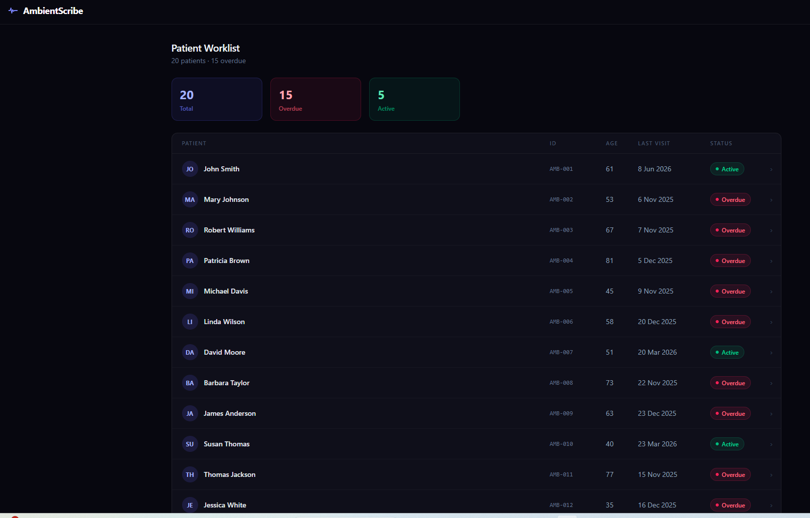
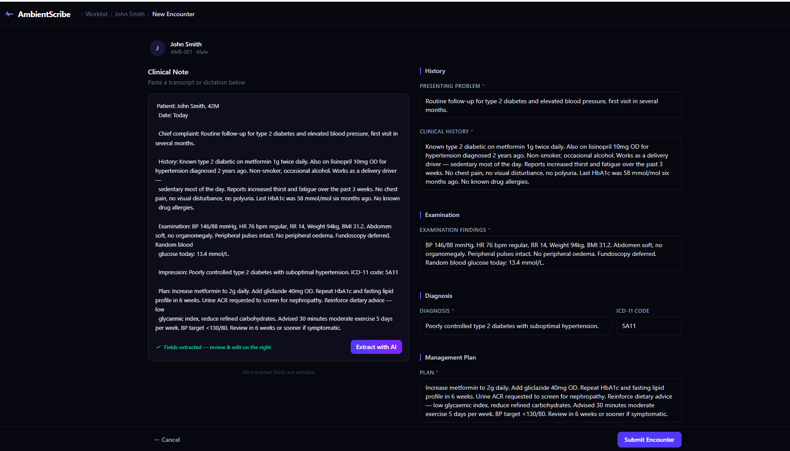

# AmbientScribe


> Paste a clinical note → LLM extracts structured fields → openEHR composition stored → fully versioned and amendable.

Clinical documentation takes 2+ hours of a doctor's day. Clinicians dictate in natural language; EHR systems want structured data. AmbientScribe closes that gap — paste any note or dictation, an LLM extracts the clinical fields, the form pre-fills for review, and the encounter is stored as a versioned openEHR composition in EHRbase.

---

## Screenshots

| Worklist | AI Extraction |
|----------|---------------|
|  |  |

> To add screenshots: take a full-page capture of the Worklist and one of New Encounter with fields populated after AI extraction. Save to `docs/screenshots/`.

---

## What it does

| Feature | Description |
|---------|-------------|
| **Patient Worklist** | Active patient list with overdue follow-up flags (>12 weeks since last visit) |
| **Patient Detail** | Demographics, encounter history, direct navigation to any past encounter |
| **AI Extraction** | Paste any clinical note — LLM extracts all 6 structured fields simultaneously |
| **Two-column Encounter Form** | Note on the left (sticky), structured editable fields on the right |
| **openEHR Storage** | Every encounter stored as a FLAT composition in EHRbase, fully schema-valid |
| **Versioned Amendment** | Edit any encounter — EHRbase preserves the full version chain automatically |

---

## How it works

```
Clinical note (free text)
        │
        ▼
   LLM extraction
   (json_object mode)
        │
        ▼
┌───────────────────────────────────────────┐
│  Presenting problem  │  Clinical history  │
│  Examination         │  Diagnosis         │
│  ICD-11 code         │  Management plan   │
└───────────────────────────────────────────┘
        │  all fields editable before submit
        ▼
  EHRbase FLAT API  →  openEHR composition
  (versioned, queryable via AQL)
```

---

## Tech Stack

| Layer | Choice |
|-------|--------|
| Frontend | React 19 · TypeScript · Tailwind CSS v4 · Vite |
| AI | OpenAI GPT-4o — `json_object` mode, single-call, no streaming. The model is a configuration choice. |
| Clinical data store | EHRbase 0.30 (openEHR CDR) |
| Database | PostgreSQL |
| Containerisation | Docker Compose |

---

## openEHR Template

**Template ID:** `outpatient_encounter`

| Archetype | Purpose |
|-----------|---------|
| `openEHR-EHR-COMPOSITION.report.v1` | Outer composition shell |
| `openEHR-EHR-EVALUATION.reason_for_encounter.v1` | Presenting condition |
| `openEHR-EHR-OBSERVATION.story.v1` | Clinical history |
| `openEHR-EHR-OBSERVATION.exam.v1` | Examination findings |
| `openEHR-EHR-EVALUATION.problem_diagnosis.v1` | Diagnosis + ICD-11 code |
| `openEHR-EHR-EVALUATION.clinical_synopsis.v1` | Management plan |

---

## Services

| Service | Port |
|---------|------|
| EHRbase | 8086 |
| PostgreSQL | 5436 |
| Frontend (dev) | 5173 |

---

## Quick Start

**Prerequisites:** Docker Desktop, Node.js 20+, an OpenAI API key.

### 1. Add your API key

Create `frontend/.env.local` — this file is gitignored and never committed:

```
VITE_OPENAI_API_KEY=sk-...
```

### 2. Start everything

```powershell
.\dev-start.ps1
```

This script:
- Starts EHRbase + PostgreSQL via Docker Compose
- Waits for EHRbase to be healthy
- Uploads the `outpatient_encounter` template if missing
- Installs frontend dependencies if needed
- Validates that `frontend/.env.local` contains a real key
- Opens the Vite dev server in a new terminal

Then open **http://localhost:5173**

### 3. Stop

```powershell
.\dev-stop.ps1          # stops dev server, leaves Docker running
.\dev-stop.ps1 -Docker  # stops dev server AND Docker containers
```

### Re-seed from scratch

If you've run `docker compose down -v` and need to restore the 20 demo patients:

```powershell
cd scripts
npm run upload-template
npm run seed
```

---

## Non-obvious gotchas

Things that cost real time and aren't documented well anywhere:

**1. openEHR FLAT API composition structure**
The FLAT format requires exact path keys that match your OPT. Invalid or missing paths fail silently or return cryptic 400 errors. See [`docs/flat-paths.md`](./docs/flat-paths.md) for the full verified path reference.

**2. EHRbase 0.30 rejects PUT with an Origin header**
Browsers attach `Origin` automatically on every non-GET fetch — including same-origin requests. EHRbase's CORS config allows POST but not PUT with an Origin header, returning a silent 403. Fixed in `vite.config.ts` by stripping the header in the proxy's `proxyReq` handler before forwarding.

**3. DV_CODED_TEXT requires both code and terminology**
Sending an empty ICD-11 code field causes a validation error. The service layer falls back to `terminology: local, code: unspecified` when no code is provided.

---

## Project structure

```
├── frontend/
│   ├── src/
│   │   ├── components/       # Layout, Button
│   │   ├── pages/            # Worklist, PatientDetail, NewEncounter, ViewEncounter
│   │   ├── services/         # EHRbaseService.ts, OpenAIService.ts
│   │   ├── config/           # template-config.ts (FLAT paths, AQL fragments)
│   │   └── data/             # patients.ts (demo demographics)
│   ├── .env.local            # ← your API key goes here (gitignored)
│   └── vite.config.ts        # proxy + Origin header strip
├── scripts/                  # upload-template, seed
├── templates/                # outpatient_encounter OPT
├── docker-compose.yml
├── dev-start.ps1
└── dev-stop.ps1
```

---

## Key concepts

- **openEHR FLAT API** — lightweight JSON representation of a composition, used for both POST (create) and PUT (update)
- **AQL** — Archetype Query Language, used for the patient worklist and encounter history queries
- **Composition versioning** — EHRbase auto-increments the version suffix (`::1`, `::2`) on every PUT; no client-side ETag handling required for ECIS v1
- **LLM extraction** — `json_object` response format enforces structured output; all fields remain editable before the clinician submits

---

## Documents

- [`docs/flat-paths.md`](./docs/flat-paths.md) — verified FLAT path reference, AQL paths, EHRbase 0.30 quirks
- [`CONCEPT.md`](./CONCEPT.md) — design rationale and openEHR patterns
